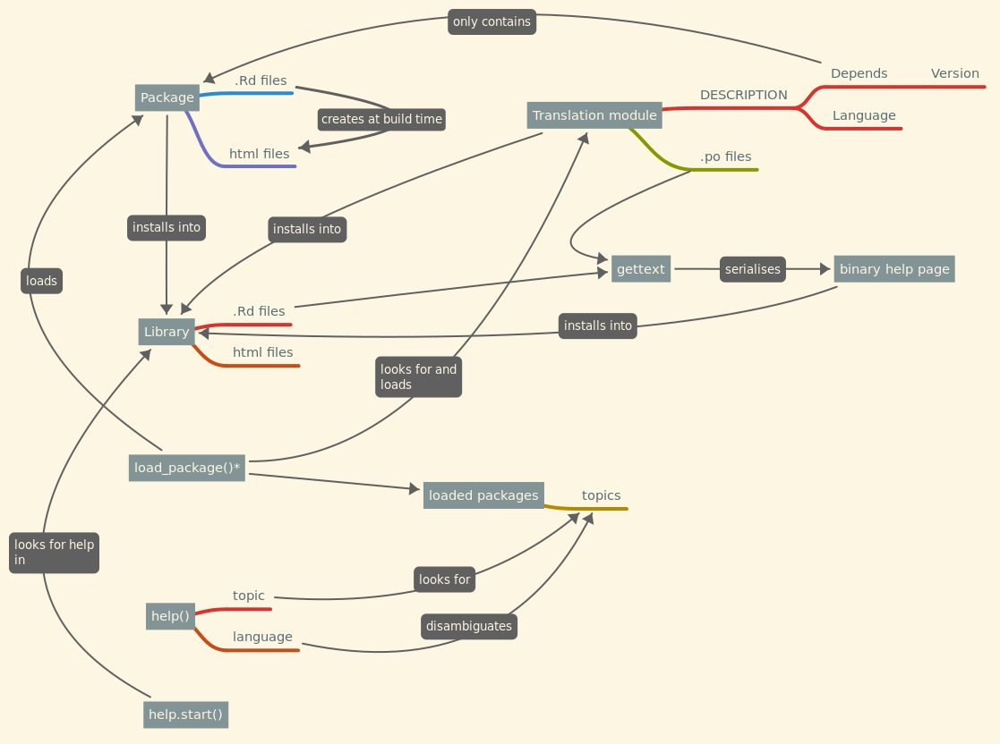

# The proposal

```{=html}
<!--
This is where the proposal should be outlined. 
-->
```
## Overview

```{=html}
<!--
At a high-level address what your proposal is and how it will address the problem identified. Highlight any benefits to the R Community that follow from solving the problem. This should be your most compelling section.
-->
```

We aim at extending the R help system to allow for multiple help pages for the same function in different languages by installing translation modules,
as discussed at the R Project Sprint 2023 in conversation with R Core members Martin Mächler, Deepayan Sarcar and Michael Lawrence..
By default, `help()` would show the documentation in the preferred language of the user, if available, and fall-back to the canonical documentation otherwise (most likely, in English).
It would also include a link to the canonical documentation and warnings if translations are out of date.

## Detail

```{=html}
<!--
Go into more detail about the specifics of the project and it delivers against the problem.

Depending on project type the detail section should include:

 - [ ] Minimum Viable Product
 - [ ] Architecture
 - [ ] Assumptions
-->
```
-   Original packages have their "canonical" help pages written in the original languages as usual (e.g. `mein.paket` is documented in German).

-   Translated documentation to a language is hosted in a translation module (e.g. `mein_paket.en` would provide English documentation for `mein.paket`).

    -   These modules are R packages that use the PackageType field to indicate that they are a translation module (e.g. `PackageType: translation`).
        The Depends field is used to indicate the package being translated and the minimum version supported.

    -   They store .po files with the translated strings.

    -   The user can install translation modules using `install.packages()` to get the documentation in that language.

    -   Translation modules are not necessarily maintained by the original package authors.
        In principle, multiple translation modules for the same package and the same language could exist and the user can chose which version they install.

    -   These modules could be hosted on CRAN or a CRAN-like repository.
        Optionally, CRAN could develop quality checks on translation modules to ensure that they are up-to-date, such as a maximum percentage of missing strings or maximum percentage of fuzzy matches.

-   When a translation module is installed, the .Rd files of the original package are parsed and translated using `gettext()` and the .po files in the translation module, and serialised into binary help pages (like regular packages have).

-   When loading a package, R will also search for installed translations and load them too.

-   `help()` gains an new "language" argument which defaults to `Sys.getenv("LANGUAGE")`.

-   `help()` searches for the loaded topics.
    If any translation is available, then it would use the `language` argument to disambiguate.

-   Help pages would be modified to include include a link to the original (canonical) documentation and add warnings if strings are untranslated/outdated.

{width="537"}
